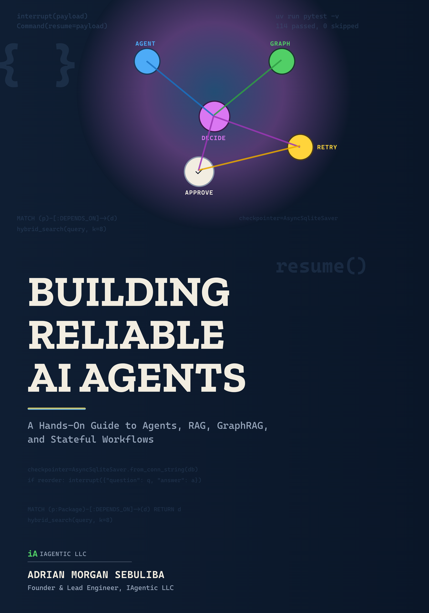

# reliable-agents-labs



Companion code for *Building Reliable AI Agents* (Book 2 of the "Production AI Agent Engineering" series). Every chapter in the book has a matching git tag here, real, tested, runnable code, not illustrative snippets.

Two real systems get built, escalating from a single tool call to a full stateful, observed, evaluated production system:

- **The reorder agent** (Projects 1 & 4): starts as a single-tool stock-check agent, becomes a LangGraph-orchestrated procurement workflow with human-approval gates for spending above a threshold.
- **The package dependency intelligence assistant** (Projects 2 & 3): starts as RAG over real package metadata, becomes a GraphRAG system answering relationship questions ("what breaks if I upgrade X") that plain similarity search can't.

## Quickstart

```bash
git clone https://github.com/Sebuliba-Adrian/reliable-agents-labs.git
cd reliable-agents-labs
cp .env.example .env   # fill in GEMINI_API_KEY at minimum
uv sync --locked
uv run pytest
```

## Stack

Qdrant (vector DB, from Project 2) · Neo4j (graph DB, from Project 3) · LangGraph (orchestration, from Project 4) · Langfuse (observability) · FastAPI · Pydantic · pytest · `uv` · Ruff.

Model provider: Gemini via its OpenAI-compatible API by default (a live key is available to smoke-test every example as it's written), Anthropic's native SDK as a config-switchable alternative. See `src/reliable_agents_labs/models.py` and `config/models.yaml`.

## Testing

Five tiers, see each directory's own docstring for what belongs there: `tests/unit`, `tests/orchestration` (scripted fake model), `tests/integration` (real local services), `tests/contract` (real model call), `tests/evals` (golden dataset). Fast tiers run on every push; live tiers run on version tags and manual dispatch only (see `.github/workflows/ci.yml`).

## Repository shape

```
src/reliable_agents_labs/   application code
tests/{unit,orchestration,integration,contract,evals}/
evals/{datasets,graders,baselines}/
prompts/                    versioned prompt files, not inline strings
config/{models.yaml,policies.yaml}
migrations/
scripts/
docs/diagrams/
```
